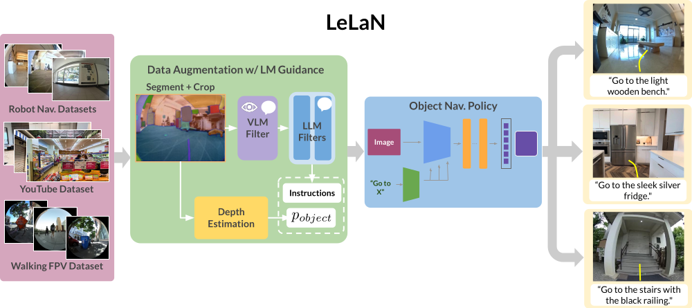

# LeLaN: Learning A Language-conditioned Navigation Policy from In-the-Wild Video
[](https://arxiv.org/pdf/2407.08693)
[](https://www.python.org)
[](https://opensource.org/licenses/MIT)
[](https://learning-language-navigation.github.io)


[Noriaki Hirose](https://sites.google.com/view/noriaki-hirose/)<sup>1, 2</sup>, [Catherine Glossop](https://www.linkedin.com/in/catherineglossop/)<sup>1</sup>\*, [Ajay Sridhar](https://ajaysridhar.com/)<sup>1</sup>\*, [Oier Mees](https://www.oiermees.com/)<sup>1</sup>, [Sergey Levine](https://people.eecs.berkeley.edu/~svlevine/)<sup>1</sup>

<sup>1</sup> UC Berkeley (_Berkeley AI Research_),  <sup>2</sup> Toyota Motor North America, \* indicates equal contributiion

We present LeLaN, a novel method leverages foundation models to label in-the-wild video data with
language instructions for object navigation. We train an object navigation policy on this data, result-
ing in state-of-the-art performance on challenging zero-shot language-conditioned object navigation
task across a wide variety of indoor and outdoor environments.





### Installation
Please down load our code and install some tools for making a conda environment to run our code. We recommend to run our code in the conda environment, although we do not mention the conda environments later.

1. Download the repository on your PC:
    ```
    git clone https://github.com/NHirose/learning-language-navigation.git
    ```
2. Set up the conda environment:
    ```
    conda env create -f train/train_lelan.yml
    ```
3. Source the conda environment:
    ```
    conda activate lelan
    ```
4. Install the lelan packages:
    ```
    pip install -e train/
    ```
5. Install the `diffusion_policy` package from this [repo](https://github.com/real-stanford/diffusion_policy):
    ```
    git clone git@github.com:real-stanford/diffusion_policy.git
    pip install -e diffusion_policy/
    ``` 

### Data
We train our model with the following datasets. We annotate the publicly available robot navigation dataset as well as the in-the-wild videos such as YouTube. In addition, we collected the videos by holding the shperical camera and walking around outside and annotated them by our method. We publish all annotated labels and corresponding images [here](https://drive.google.com/file/d/1IazHcIyPGO7ENswz8_sGCIGBXF8_sZJK/view?usp=sharing). Note that we provide the python code to download and save the images from the YouTube videos instead of providing the images, due to avoiding the copyright issue.

- Robot navigation dataset (GO Stanford2, GO Stanford4, and SACSoN)
- Human-walking dataset
- YouTube tour dataset

Followings are the process to use our dataset on our training code.
1. Download the dataset from [here](https://drive.google.com/file/d/1IazHcIyPGO7ENswz8_sGCIGBXF8_sZJK/view?usp=sharing) and unzip the file in the downloaded repository:

2. Change the directory:
    ```
    cd learning-language-navigation/download_youtube
    ```
3. Download the YouTube videos and save the corresponding images:
    ```
    python save_youtube_image.py
    ```
    
## Train

The subfolder `learning-language-navigation/train/` contains code for training models from your own data. The codebase assumes access to a workstation running Ubuntu (tested on 18.04 and 20.04), Python 3.7+, and a GPU with CUDA 10+. It also assumes access to conda, but you can modify it to work with other virtual environment packages, or a native setup.
### Training LeLaN
#### without collision avoidance
Run this inside the `learning-language-navigation/train` directory:
```
python train.py -c ./config/lelan.yaml
```
#### with collision avoidance using the NoMaD supervisions
Before training, please download the checkpoint of the finetuned nomad checkpoints for the cropped goal images from [here](https://drive.google.com/drive/folders/19yJcSJvGmpGlo0X-0owQKrrkPFmPKVt8?usp=sharing) and save `nomad_crop.pth` at `learning-language-navigation/train/logs/nomad/nomad_crop/`. For collision avoindace, we pre-train the policy without the collision avoidance loss. After that we can finetune it with the collision avoidance loss using the NoMaD supervisions.

Run this inside the `learning-language-navigation/train` directory for pretraining:
```
python train.py -c ./config/lelan_col_pretrain.yaml
```
Then, run this for finetuning (Note that you need to edit the folder name to specify the location of the pretrained model in lelan_col.yaml): 
```
python train.py -c ./config/lelan_col.yaml
```

##### Custom Config Files
`config/lelan.yaml` and `config/lelan_col.yaml` is the premade yaml files for the LeLaN.


##### Training your model from a checkpoint
Please carefully check the original [code](https://github.com/robodhruv/visualnav-transformer) to know how to train your model from a checkpoint.


## Deployment
The subfolder `learning-language-navigation/deployment/` contains code to load a pre-trained LeLaN and deploy it on your robot platform with a [NVIDIA Jetson Orin](https://www.nvidia.com/en-us/autonomous-machines/embedded-systems/jetson-orin/)(We test our policy on Nvidia Jetson Orin AGX). 

### Hardware Setup
We need following three hardwares to navigate the robot toward the target object location with the LeLaN.
1. Robot: Please setup the ROS on your robot to enable us to control the robot by "/cmd_vel" of geometry_msgs/Twist message. We tested on the Vizbot(Roomba base robot) and the quadruped robot Go1.

2. Camera: Please mount the camera on your robot, which we can use on ROS to publish `sensor_msgs/Image`. We tested the [ELP fisheye camera](https://www.amazon.com/ELP-170degree-Fisheye-640x480-Resolution/dp/B00VTHD17W), the [Ricoh Theta S](https://us.ricoh-imaging.com/product/theta-s/), and the [Intel D435i](https://www.intelrealsense.com/depth-camera-d435i/).

3. Joystick: [Joystick](https://www.amazon.com/Logitech-Wireless-Nano-Receiver-Controller-Vibration/dp/B0041RR0TW)/[keyboard teleop](http://wiki.ros.org/teleop_twist_keyboard) that works with Linux. Add the index mapping for the _deadman_switch_ on the joystick to the `learning-language-navigation/deployment/config/joystick.yaml`. You can find the mapping from buttons to indices for common joysticks in the [wiki](https://wiki.ros.org/joy). 


### Software Setup
#### Loading the model weights

Save the model weights *.pth file in `learning-language-navigation/deployment/model_weights` folder. Our model's weights are in [this link](https://drive.google.com/drive/folders/19yJcSJvGmpGlo0X-0owQKrrkPFmPKVt8?usp=sharing). In addition, if you want to control the robot toward the far target object, which is not seen from the initial robot location, please download the original ViNT's weights in [this link](https://drive.google.com/drive/folders/1a9yWR2iooXFAqjQHetz263--4_2FFggg) to navigate the robot with the topological memory.

#### Last-mile Navigation

If the target object location is close to the robot and visible from the robot, you can simply run the LeLaN to move toward the target object. 

1. `roscore`
2. Launch camera node: Please start the camera node to publish the topic, `sensor_msgs/Image`. For example, we use the [usb_cam](http://wiki.ros.org/usb_cam) for the [ELP fisheye camera](https://www.amazon.com/ELP-170degree-Fisheye-640x480-Resolution/dp/B00VTHD17W), the [cv_camera](http://wiki.ros.org/cv_camera) for the [spherical camera](https://us.ricoh-imaging.com/product/theta-s/) and the [realsense2_camera](http://wiki.ros.org/realsense2_camera) for the [Intel D435i](https://www.intelrealsense.com/depth-camera-d435i/). We recommned to use a wide-angle RGB camera to robustly capture the target objects.
3. Launch LeLaN policy: This command immediately run the robot toward the target objects, which correspond to the `<prompt for target object>` such as "office chair". The example of `<path for the config file>` is `'../../train/config/lelan.yaml'`, which you can specify the same yaml file in your training. `<path for the moel checkpoint>` is the path for your trained model. The default is `'../model_weights/wo_col_loss_wo_temp.pth'`. `<bool for camera type>` is the boolean to specify whether the camera is the Ricoh Theta S or not.
```
python lelan_policy_col.py -p <prompt for target object> -c <path for the config file> -m <path for the moel checkpoint> -r <boolean for camera type>
```


Note that you manually change the topic name, 'TOPIC_NAME_CAMERA' in `lelan_policy_col.py`, before running the above command.

#### Long-distance Navigation

Since it is difficult for the LeLaN to navigate toward the far target object, we provide the system leveraging the topological map.
There are three steps in our approach, 0) search all node images and specify the target node capturing the tareget object, 1) move toward the target node, which is close to the target object, and 2) switch the policy to the LeLaN and go to the target object location. To search the target node in the topological memory in 0), we use Owl-ViT2 for scoring all nodes and select the node with the highest score. And, we use the ViNT policy for 1). Before navigation, we collect the topological map in your environment by teleperation. Then we can run our robot toward the far target object.

##### Collecting a Topological Map

_Make sure to run these scripts inside the `learning-language-navigation/deployment/src/` directory._

##### Record the rosbag: 
Run this command to teleoperate the robot with the joystick and camera. This command opens up three windows 
1. Launch the robot driver: please launch the robot driver and setup the node, which eable us to run the robot via a topic of `geometry_msgs/Twist` for the velocity commands, `/cmd_vel`. 
2. Launch the camera driver: please launch the `usb_cam` node for the camera. 
3. Launch the joystic driver: please launch the joystic driver to publish `/cmd_vel`.
4. `rosbag record /usb_cam/image_raw -o <bag_name>`: This command isn’t run immediately (you have to click Enter). It will be run in the learning-language-navigation/deployment/topomaps/bags directory, where we recommend you store your rosbags.

Once you are ready to record the bag, run the `rosbag record` script and teleoperate the robot on the map you want the robot to follow. When you are finished with recording the path, kill the `rosbag record` command, and then kill all sessions.

##### Make the topological map: 
Please open 3 windows and run followings one by one:
1. `roscore`
2. `python create_topomap.py —dt 1 —dir <topomap_dir>`: This command creates a directory in `/learning-language-navigation/deployment/topomaps/images` and saves an image as a node in the map every second the bag is played.
3. `rosbag play -r 1.5 <bag_filename>`: This command plays the rosbag at x1.5 speed, so the python script is actually recording nodes 1.5 seconds apart. The `<bag_filename>` should be the entire bag name with the .bag extension.

When the bag stops playing, kill all sessions.


#### Running the model 
Please open 4 windows:

1. launch the robot driver: please launch the robot driver and setup the node, which eable us to run the robot via a topic of `geometry_msgs/Twist` for the velocity commands, `/cmd_vel`. 
2. launch the camera driver: please launch the `usb_cam` node for the camera. 
3. `python pd_controller_lelan.py`: In the graph-based navigation phase, this python script starts a node that reads messages from the `/waypoint` topic (waypoints from the model) and outputs velocities by PD controller to navigate the robot’s base. In the final approach phase, this script selects the velocity commands from the LeLaN.
4. `python navigate_lelan.py -p <prompt> --model vint -—dir <topomap_dir>`: In the graph-based navigation phase, this python script starts a node that reads in image observations from the `/usb_cam/image_raw` topic, inputs the observations and the map into the model, and publishes actions to the `/waypoint` topic. In the final approach phase, this script calculates the LeLaN policy and publishes the velocity commands to the `/vel_lelan` topic.

The `<topomap_dir>` is the name of the directory in `learning-language-navigation/deployment/topomaps/images` that has the images corresponding to the nodes in the topological map. The images are ordered by name from 0 to N.
When the robot is finishing navigating, kill the `pd_controller_lelan.py` script, and then kill all sessions. In the default setting, we run the simplest LeLaN policy not feeding the history of the image and not considering collision avoidance. 

## Citing
Our main project
```
@inproceedings{hirose2024lelan,
  title     = {LeLaN: Learning A Language-conditioned Navigation Policy from In-the-Wild Video},
  author    = {Noriaki Hirose and Catherine Glossop and Ajay Sridhar and Oier Mees and Sergey Levine},
  booktitle = {8th Annual Conference on Robot Learning},
  year      = {2024},
  url       = {https://arxiv.org/abs/xxxxxxxx}
}
```
Robotic navigation dataset: GO Stanford 2
```
@inproceedings{hirose2018gonet,
  title={Gonet: A semi-supervised deep learning approach for traversability estimation},
  author={Hirose, Noriaki and Sadeghian, Amir and V{\'a}zquez, Marynel and Goebel, Patrick and Savarese, Silvio},
  booktitle={2018 IEEE/RSJ International Conference on Intelligent Robots and Systems (IROS)},
  pages={3044--3051},
  year={2018},
  organization={IEEE}
}
```
Robotic navigation dataset: GO Stanford 4
```
@article{hirose2019deep,
  title={Deep visual mpc-policy learning for navigation},
  author={Hirose, Noriaki and Xia, Fei and Mart{\'\i}n-Mart{\'\i}n, Roberto and Sadeghian, Amir and Savarese, Silvio},
  journal={IEEE Robotics and Automation Letters},
  volume={4},
  number={4},
  pages={3184--3191},
  year={2019},
  publisher={IEEE}
}
```
Robotic navigation dataset: SACSoN(HuRoN)
```
@article{hirose2023sacson,
  title={Sacson: Scalable autonomous control for social navigation},
  author={Hirose, Noriaki and Shah, Dhruv and Sridhar, Ajay and Levine, Sergey},
  journal={IEEE Robotics and Automation Letters},
  year={2023},
  publisher={IEEE}
}
```

